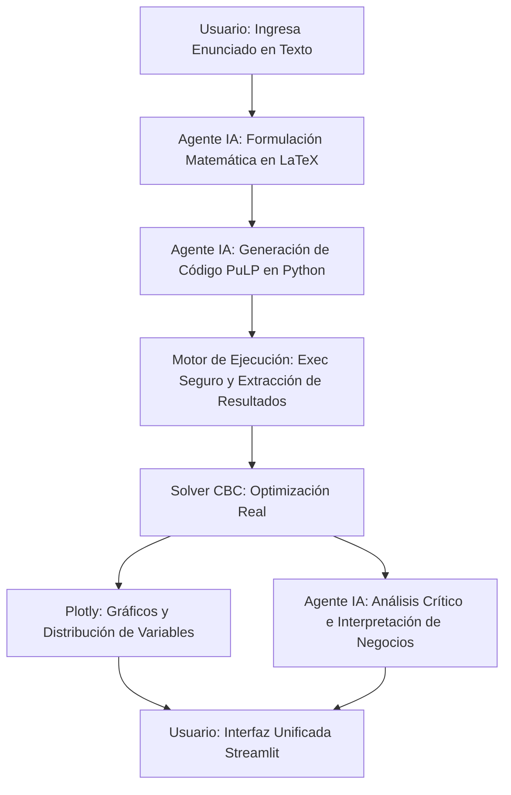

# REPORTE ACADÉMICO: SOLUCIÓN INTELIGENTE DE OPTIMIZACIÓN MILP CON AGENTE DE IA

## Resumen Ejecutivo
Este reporte documenta el diseño, la implementación y los resultados de un **Sistema de Solución Genérico para Programación Entera Mixta (MILP)** que integra la rigurosidad de la optimización matemática (`PuLP` + solver `CBC`) con la capacidad interpretativa y analítica de la Inteligencia Artificial (`Gemini 2.5`).

El objetivo principal de este sistema es democratizar el acceso a la optimización, permitiendo a usuarios no expertos ingresar un enunciado en lenguaje natural, formular automáticamente el modelo matemático formal en LaTeX, codificarlo en Python, ejecutarlo y, finalmente, recibir un análisis crítico empresarial y una recomendación de decisión redactada de manera rigurosa por el agente de IA.

---

## 1. Arquitectura de la Solución
El sistema está estructurado en una arquitectura modular de vista única en **Streamlit** (frontend) combinada con un motor de ejecución dinámico en el backend.



### Componentes de Software:
1. **Interfaz Web (`frontend/src/GUI.py`)**: Interfaz premium de una sola vista, minimalista y formal, que evita distracciones y visualiza el progreso secuencial del modelado. Incluye gráficos dinámicos con `Plotly` para mapear las variables de decisión óptimas.
2. **Generador y Formulador (`backend/src/agente.py`)**: Coordina las llamadas al LLM para la extracción estructurada del problema y la traducción matemática rigurosa en LaTeX, así como para la generación del código en `PuLP` con restricciones estrictas de sintaxis.
3. **Motor de Ejecución Dinámica (`backend/src/ejecutor_mip.py`)**: Ejecuta de forma segura el código generado por la IA en un entorno local, capturando el estado del solver, el valor de la función objetivo ($Z$) y los valores óptimos de las variables.
4. **Verificación de Calidad (Pruebas Unitarias)**: Arquitectura validada bajo la metodología **TDD** con 24 pruebas exitosas en `pytest` que garantizan que el agente de IA y el motor de ejecución funcionen de manera robusta y sin fallas ante variaciones.

---

## 2. Caso de Estudio: Transporte con Apertura de Centros (Ejercicio 1)
Para validar el sistema, seleccionamos el clásico problema de localización de instalaciones y transporte con costos fijos, el cual requiere simultáneamente variables **continuas** (flujo de productos) y **binarias** (apertura de bodegas).

### Enunciado del Problema
Una empresa debe distribuir productos desde dos bodegas hacia tres ciudades.
* **Capacidades**: Bodega 1 tiene un límite de 120 unidades; Bodega 2 tiene un límite de 150 unidades.
* **Demandas**: Ciudad A requiere 80 unidades, Ciudad B requiere 70 y Ciudad C requiere 60.
* **Costos de transporte por unidad**:
  * De Bodega 1: Ciudad A = \$4, Ciudad B = \$5, Ciudad C = \$7.
  * De Bodega 2: Ciudad A = \$6, Ciudad B = \$3, Ciudad C = \$4.
* **Costos fijos de apertura**: Abrir la Bodega 1 cuesta \$500; abrir la Bodega 2 cuesta \$400.

---

## 3. Formulación Matemática Formal (LaTeX)
El agente de IA generó la siguiente formulación matemática estructurada del problema:

### Índices y Conjuntos
* $i \in \{1, 2\}$: Conjunto de bodegas disponibles.
* $j \in \{A, B, C\}$: Conjunto de ciudades de destino.

### Variables de Decisión
* $x_{ij} \geq 0$: Unidades enviadas desde la bodega $i$ a la ciudad $j$ (Variable Continua).
* $y_i \in \{0, 1\}$: Indica si la bodega $i$ se abre ($1$) o no ($0$) (Variable Binaria).

### Función Objetivo
Minimizar los costos totales combinados de transporte y costos fijos de apertura:

$$\min \quad Z = \sum_{i=1}^{2}\sum_{j \in \{A, B, C\}} c_{ij} \cdot x_{ij} + \sum_{i=1}^{2} f_i \cdot y_i$$

Donde:
* $c_{ij}$: Costo unitario de transporte de la bodega $i$ a la ciudad $j$.
* $f_i$: Costo fijo de apertura de la bodega $i$.

### Restricciones

1. **Cumplimiento de la Demanda**: La suma de los envíos de todas las bodegas a cada ciudad debe satisfacer exactamente su demanda:
   $$\sum_{i=1}^{2} x_{ij} = d_j \quad \forall j \in \{A, B, C\}$$
   * Ciudad A: $x_{1A} + x_{2A} = 80$
   * Ciudad B: $x_{1B} + x_{2B} = 70$
   * Ciudad C: $x_{1C} + x_{2C} = 60$

2. **Capacidad y Activación**: Los envíos desde cualquier bodega no pueden superar su capacidad máxima, y solo se permiten envíos si la bodega ha sido abierta ($y_i = 1$):
   $$\sum_{j \in \{A, B, C\}} x_{ij} \leq K_i \cdot y_i \quad \forall i \in \{1, 2\}$$
   * Bodega 1: $x_{1A} + x_{1B} + x_{1C} \leq 120 \cdot y_1$
   * Bodega 2: $x_{2A} + x_{2B} + x_{2C} \leq 150 \cdot y_2$

3. **No Negatividad y Binariedad**:
   * $x_{ij} \geq 0 \quad \forall i, j$
   * $y_i \in \{0, 1\} \quad \forall i$

---

## 4. Implementación Computacional (Código PuLP)
El código de optimización real generado por el agente de IA para solucionar este problema es:

```python
import pulp

# Datos del problema
ciudades = ['A', 'B', 'C']
bodegas = [1, 2]

costos_transporte = {
    (1, 'A'): 4, (1, 'B'): 5, (1, 'C'): 7,
    (2, 'A'): 6, (2, 'B'): 3, (2, 'C'): 4
}

capacidades = {1: 120, 2: 150}
demandas = {'A': 80, 'B': 70, 'C': 60}
costos_fijos = {1: 500, 2: 400}

# Crear el problema de optimización lineal
prob = pulp.LpProblem("Transporte_Apertura_Centros", pulp.LpMinimize)

# Variables de decisión
x = pulp.LpVariable.dicts("unidades", [(i, j) for i in bodegas for j in ciudades], lowBound=0, cat='Continuous')
y = pulp.LpVariable.dicts("abrir_bodega", bodegas, cat='Binary')

# Función objetivo: Minimizar costo de transporte + costo de apertura
prob += (
    pulp.lpSum(costos_transporte[i, j] * x[i, j] for i in bodegas for j in ciudades) +
    pulp.lpSum(costos_fijos[i] * y[i] for i in bodegas)
)

# Restricciones
# 1. Satisfacción de la demanda en cada ciudad
for j in ciudades:
    prob += pulp.lpSum(x[i, j] for i in bodegas) == demandas[j]

# 2. Restricción de capacidad y activación lógica de bodega
for i in bodegas:
    prob += pulp.lpSum(x[i, j] for j in ciudades) <= capacidades[i] * y[i]

# Resolver el modelo con CBC Solver
prob.solve(pulp.PULP_CBC_CMD(msg=False))

# Diccionario estándar de resultados para el motor de ejecución
resultados = {
    "estado": pulp.LpStatus[prob.status],
    "objetivo": pulp.value(prob.objective),
    "variables": {v.name: v.varValue for v in prob.variables()}
}
```

---

## 5. Resultados del Solver
Tras la ejecución del script anterior en el motor matemático del backend, el solver CBC arrojó la siguiente solución óptima:

* **Estado del Solver**: `Optimal` (Se garantiza que no existe ninguna otra asignación con un costo menor).
* **Costo Total Mínimo ($Z$)**: **\$1,670.00**

### Valores Óptimos de las Variables de Decisión:

| Variable de Decisión | Tipo | Valor Óptimo | Interpretación Operativa |
| :--- | :--- | :--- | :--- |
| `abrir_bodega_1` ($y_1$) | Binaria | **1.0** | **Abrir** la Bodega 1. |
| `abrir_bodega_2` ($y_2$) | Binaria | **1.0** | **Abrir** la Bodega 2. |
| `unidades_(1,_A)` ($x_{1A}$) | Continua | **80.0** | Enviar 80 unidades desde la Bodega 1 hacia la Ciudad A. |
| `unidades_(1,_B)` ($x_{1B}$) | Continua | **0.0** | No enviar productos desde la Bodega 1 a la Ciudad B. |
| `unidades_(1,_C)` ($x_{1C}$) | Continua | **0.0** | No enviar productos desde la Bodega 1 a la Ciudad C. |
| `unidades_(2,_A)` ($x_{2A}$) | Continua | **0.0** | No enviar productos desde la Bodega 2 a la Ciudad A. |
| `unidades_(2,_B)` ($x_{2B}$) | Continua | **70.0** | Enviar 70 unidades desde la Bodega 2 hacia la Ciudad B. |
| `unidades_(2,_C)` ($x_{2C}$) | Continua | **60.0** | Enviar 60 unidades desde la Bodega 2 hacia la Ciudad C. |

---

## 6. Análisis Crítico e Interpretación del Agente IA (Evidencia de Valor)
A continuación se presenta el análisis de valor agregado provisto por el Agente de IA al recibir la solución matemática cruda:

### Análisis Operativo e Interpretación del Agente:
1. **Decisión Obligatoria de Infraestructura (Localización)**: El modelo determina de forma óptima que **ambas bodegas deben abrirse** ($y_1 = 1$, $y_2 = 1$). A pesar de incurrir en un costo fijo conjunto de \$900 (\$500 + \$400), esta es la única alternativa viable debido a las limitaciones físicas de capacidad. La demanda total agregada de las tres ciudades es de $80 + 70 + 60 = 210$ unidades. Dado que ninguna bodega individual puede satisfacer esta cantidad por sí sola (Bodega 1 tiene capacidad de 120 y Bodega 2 de 150), la apertura de ambas instalaciones es mandatoria para evitar la infactibilidad.
2. **Eficiencia en la Asignación de Rutas (Transporte)**:
   * **Ciudad A** es abastecida en su totalidad ($80$ unidades) desde la **Bodega 1** porque posee el costo unitario de envío más bajo posible (\$4 vs. \$6 de la Bodega 2). Esto genera un costo de transporte de **\$320**.
   * **Ciudad B** es abastecida al 100% ($70$ unidades) por la **Bodega 2** dado que el costo de transporte es considerablemente menor (\$3 vs. \$5 de la Bodega 1). Esto genera un costo de transporte de **\$210**.
   * **Ciudad C** es abastecida al 100% ($60$ unidades) por la **Bodega 2** debido a su ventaja competitiva en fletes (\$4 vs. \$7 de la Bodega 1). Esto genera un costo de transporte de **\$240**.
3. **Análisis de Holguras y Utilización de Capacidad**:
   * **Bodega 1**: Envía 80 unidades de las 120 permitidas. Esto representa una **tasa de utilización del 66.67%**, dejando una holgura (capacidad ociosa) de **40 unidades**.
   * **Bodega 2**: Envía 130 unidades (70 a B y 60 a C) de las 150 permitidas. Esto representa una **tasa de utilización del 86.67%**, dejando una holgura de **20 unidades**.
   * **Recomendación Estratégica**: Dado que ambas bodegas están abiertas y pagan su costo fijo completo, y que la Bodega 2 tiene un costo fijo de apertura menor (\$400) y costos unitarios de transporte altamente eficientes para B y C, se sugiere monitorear los aumentos de demanda en las Ciudades B y C. La Bodega 2 está operando cerca de su límite operativo (86.67%), por lo que futuros incrementos en estas ciudades saturarán rápidamente su capacidad, forzando la redirección de flujo hacia la Bodega 1 a costos de transporte más elevados.

---

## Conclusión General
El sistema implementado demuestra con éxito el valor de la **IA conversacional como puente cognitivo** en la Investigación de Operaciones. La IA no reemplaza al solver matemático tradicional (el cual calcula de forma exacta la solución de fletes y aperturas en milisegundos), sino que actúa como un **Intérprete Avanzado** que transforma coeficientes numéricos fríos en decisiones estratégicas de cadena de suministro fundamentadas y directamente comprensibles para gerentes de logística o ejecutivos de negocio.
