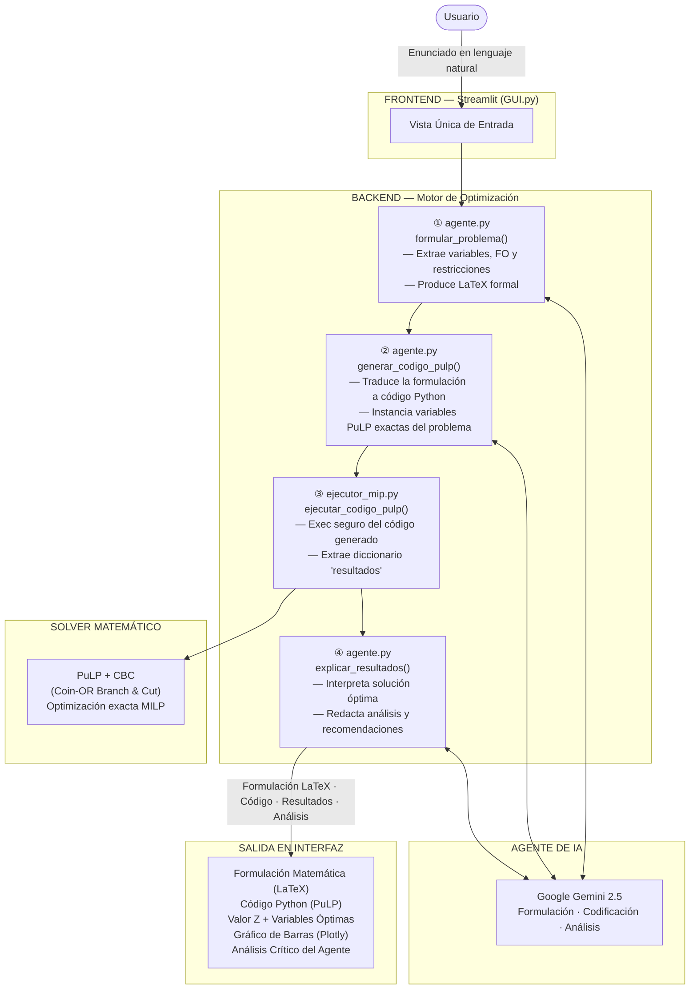

# AgenteIA — MIP

Sistema inteligente de solución genérica para problemas de **Programación Entera Mixta (MILP)**. El usuario ingresa cualquier enunciado en lenguaje natural y el sistema formula el modelo matemático en LaTeX, genera y ejecuta el código de optimización en Python (`PuLP`), y entrega un análisis crítico formal redactado por el Agente de IA (`Gemini`).

---

## Arquitectura del Sistema

El sistema opera en una **pipeline de cuatro etapas secuenciales**. El usuario interactúa únicamente con una interfaz de una sola vista en Streamlit; el resto ocurre en el backend de forma automática.



---

## Descripción de Componentes

### `frontend/src/GUI.py` — Interfaz de Usuario (Streamlit)

Interfaz de **vista única** con diseño formal y minimalista. El usuario ingresa el enunciado del problema y el sistema muestra el progreso secuencial:

1. Formulación matemática en LaTeX
2. Código PuLP autogenerado por la IA
3. Estado del solver, valor objetivo ($Z$) y tabla de variables óptimas
4. Gráfico de barras interactivo (Plotly) con la distribución de variables
5. Análisis crítico y conclusión del Agente IA

### `backend/src/agente.py` — Orquestador de IA

Módulo central que coordina tres llamadas al LLM con prompts inyectados de manera estructurada:

| Función | Responsabilidad |
| :--- | :--- |
| `formular_problema(enunciado)` | Extrae y estructura el modelo matemático formal en LaTeX (variables, FO, restricciones). |
| `generar_codigo_pulp(enunciado, formulacion)` | Traduce la formulación al código Python exacto en PuLP, con las variables, datos y restricciones reales del problema. |
| `explicar_resultados(enunciado, resultados)` | Interpreta el resultado del solver y redacta el análisis crítico y las recomendaciones de decisión. |

### `backend/src/ejecutor_mip.py` — Motor de Ejecución Dinámica

Ejecuta de forma segura el código Python generado por la IA usando `exec()` en un entorno aislado. Extrae el diccionario `resultados` estandarizado con:
- `"estado"`: Estado del solver (e.g., `"Optimal"`)
- `"objetivo"`: Valor de la función objetivo $Z$
- `"variables"`: Mapa `{nombre_variable: valor_óptimo}`

Si el código generado contiene errores de sintaxis o falla la ejecución, el módulo los intercepta y los retorna de forma controlada sin romper la aplicación.

### `backend/src/modelo_mip.py` — Modelo Estático de Referencia

Motor de optimización del modelo original de planificación de producción de fábrica. Se mantiene como referencia de implementación y como objetivo de la suite de tests TDD de 19 casos.

### `tests/` — Suite de Pruebas TDD

| Archivo | Tests | Descripción |
| :--- | :---: | :--- |
| `test_ejecutor.py` | 2 | Valida ejecución segura de código dinámico y captura de errores. |
| `test_agente.py` | 3 | Valida los tres flujos de prompts del orquestador con mocks del LLM. |
| `test_modelo_mip.py` | 19 | Valida el solver estático (variables mixtas, restricciones, escenarios). |
| **Total** | **24** | **24 passed** con `pytest` |

### `tests/testeos.md` — Banco de Ejercicios MILP

Archivo con **10 enunciados en lenguaje natural** de distintos tipos de problemas MILP (transporte, producción, dieta, turnos, selección de proyectos, etc.). Sirve como batería de pruebas funcionales de caja negra para verificar la generalidad del sistema.

---

## Estructura de Archivos

```text
AgenteIA---MIP/
│
├── backend/
│   ├── src/
│   │   ├── agente.py           # Orquestador de prompts (Gemini)
│   │   ├── ejecutor_mip.py     # Motor de ejecución dinámica (exec seguro)
│   │   └── modelo_mip.py       # Solver estático de referencia (PuLP + CBC)
│   └── __init__.py
│
├── frontend/
│   └── src/
│       └── GUI.py              # Interfaz de vista única (Streamlit + Plotly)
│
├── tests/
│   ├── test_agente.py          # Tests del orquestador (mocks LLM)
│   ├── test_ejecutor.py        # Tests del motor de ejecución dinámica
│   ├── test_modelo_mip.py      # Tests TDD del solver estático (19 casos)
│   └── testeos.md              # Banco de 10 ejercicios MILP de verificación
│
├── data/                       # Documentación académica de referencia
├── DOCUMENTO_ENTREGABLE.md     # Reporte académico completo (caso de estudio)
├── .env                        # Credenciales de IA (API_GEM=...)
├── pyproject.toml              # Dependencias del proyecto (Poetry)
└── README.md
```

---

## Tecnologías Utilizadas

| Componente | Tecnología | Rol |
| :--- | :--- | :--- |
| Interfaz Web | `Streamlit` | Vista única, renderizado de LaTeX y Plotly |
| Gráficos | `Plotly Express` | Visualización interactiva de variables óptimas |
| Modelado MILP | `PuLP` | Definición de variables, FO y restricciones |
| Solver | `CBC (Coin-OR)` | Motor de optimización exacta Branch & Cut |
| Agente de IA | `Google Gemini 2.5` | Formulación, codificación y análisis |
| SDK de IA | `google-genai` | Cliente oficial de la API de Gemini |
| Datos | `pandas` | Estructuración de resultados en tablas |
| Variables de entorno | `python-dotenv` | Gestión de credenciales |
| Pruebas | `pytest` | Suite TDD de 24 casos |

---

## Instalación y Ejecución Local

**1. Instalar dependencias:**
```bash
pip install pulp plotly pandas google-genai streamlit python-dotenv pytest
```

**2. Configurar credenciales:**

Crear un archivo `.env` en la raíz del proyecto:
```env
API_GEM=tu_api_key_de_gemini
```

**3. Iniciar la aplicación:**
```bash
python -m streamlit run frontend/src/GUI.py
```

**4. Ejecutar la suite de pruebas TDD:**
```bash
python -m pytest tests/ -v
```

---

## Flujo de Uso

1. Abrir la aplicación en el navegador (`localhost:8501`).
2. Ingresar el enunciado completo del problema MILP en el área de texto.
3. Presionar **Procesar Problema**.
4. El sistema ejecutará automáticamente las cuatro etapas y mostrará:
   - La formulación matemática en LaTeX.
   - El código Python generado.
   - Los valores óptimos con gráfico interactivo.
   - El análisis crítico del Agente IA.

---

## Metodología de Desarrollo

El proyecto fue construido bajo la metodología **TDD (Test-Driven Development)** con ciclos **Red → Green → Refactor**:

- Cada módulo fue validado con tests escritos **antes** de su implementación.
- Los mocks del LLM en `test_agente.py` garantizan que los tests del orquestador sean deterministas e independientes de la disponibilidad de la API.
- El módulo `ejecutor_mip.py` fue diseñado para interceptar fallos del código generado por la IA sin propagar excepciones no controladas a la capa de interfaz.
